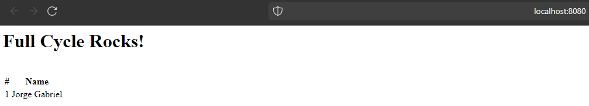

# **FullCycle 3.0 - Docker Nginx + Node.js + MySQL Challenge**

Table of contents
==========
<!--ts-->
   * [Desafio](#desafio)
   * [Requisito](#requisito)
<!--te-->

## Desafio:
 A idéia principal é que quando um usuário acesse o nginx, o mesmo fará uma chamada em nossa aplicação node.js. Essa aplicação por sua vez adicionará um registro em nosso banco de dados mysql, cadastrando um nome na tabela people.

O retorno da aplicação node.js para o nginx deverá ser:
```
<h1>Full Cycle Rocks!</h1>
```
```
Lista de nomes cadastrada no banco de dados
```
### Requisito:
Disponibilizar o acesso ao nginx na porta 8080.

### Executando o docker-compose
```
docker-compose up -d 
```
Acessando o browser:

